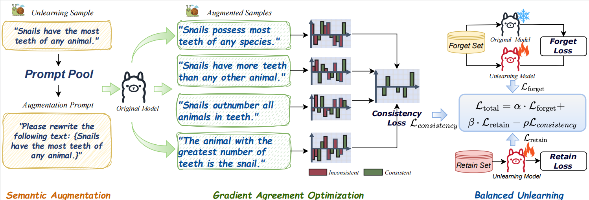

# Beyond Lexical Forgetting: Gradient Agreement Optimization for Semantic Unlearning in LLMs
Welcome to the repository! This is the detailed implementation of our project. We hope this code will serve as a valuable resource for understanding our work and its application. Thank you for your interest and support!



## Dependencies
```
huggingface-hub==0.29.1
transformers==4.45.1
numpy==2.2.3
hydra-core==1.3
hydra_colorlog==1.2.0
torch==2.4.1
datasets==3.0.1
accelerate==0.34.2
bitsandbytes==0.44.1
rouge-score==0.1.2
scipy==1.14.1
tensorboard==2.18.0
scikit-learn==1.5.2
deepspeed==0.15.4
matplotlib==3.8.0
seaborn==0.13.0
```

## Notes
Before starting, please specify Aliyun API keys in the following config files:
configs/eval/tofu_metrics/semantic_accuracy_forget.yaml
configs/eval/tofu_metrics/semantic_accuracy_retain.yaml

## Datasets
- TOFU
- MUSE

## Quick Start
```bash
# 1) Install dependencies
pip install -r requirements.txt

# 2) (Optional) Prepare/download data
python setup_data.py

# 3) Run example (TOFU)
# Train/Unlearn (example script; run in a Unix-like environment or Git Bash)
bash scripts/tofu_unlearn.sh
```
## Project Structure (brief)
- `src/`: core code
  - `src/train.py`: unified entry for training/unlearning
  - `src/eval.py`: unified entry for evaluation
  - `src/trainer/unlearn/`: implementations of unlearning methods
  - `src/evals/`: evaluation pipelines and metrics
  - `src/data/`: data processing, packaging, and collators
- `configs/`: Hydra configs (model/data/trainer/eval/experiments)
- `scripts/`: common run scripts (finetune/unlearn/eval)
- `saves/`: outputs of training and evaluation (logs, metrics, generations, etc.)

## Common Usage Examples
```bash
# Finetune (Qwen3-1.7B example)
bash scripts/tofu_finetune.sh

# Unlearn (TOFU)
bash scripts/tofu_unlearn.sh
```


## References & Acknowledgements
- This repository references parts of the [Open Unlearning](https://github.com/locuslab/open-unlearning) codebase.


